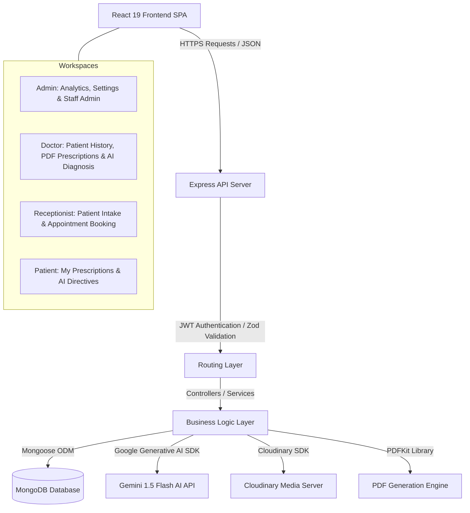
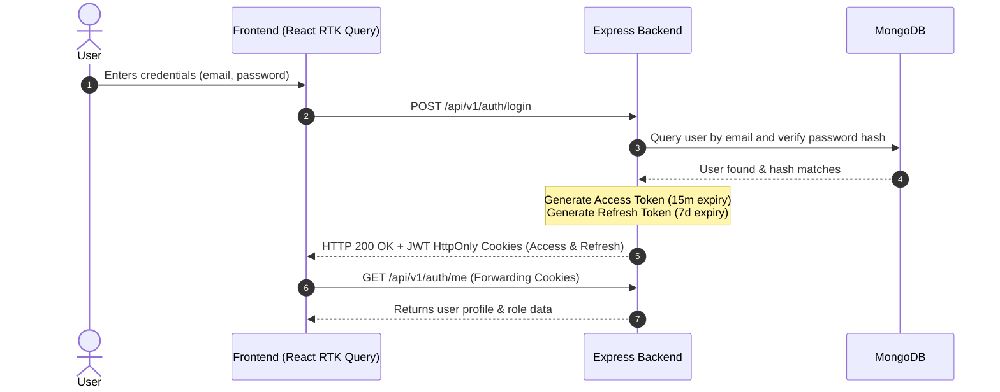
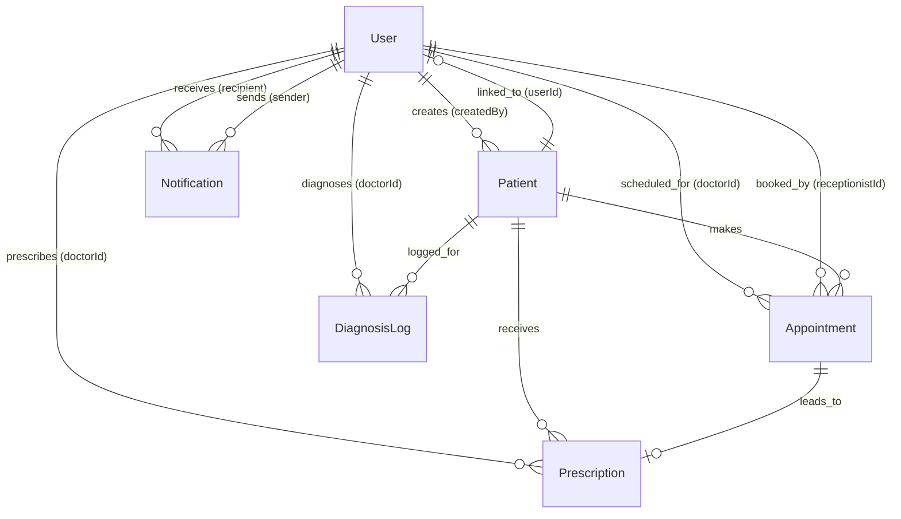

# ClinicOS — Healthcare Management System & Clinical AI Assistant

ClinicOS is a modern, enterprise-grade clinic operating system and Electronic Health Record (EHR) management solution. It is designed to streamline clinical scheduling, patient records, prescription authoring, and clinical intelligence using AI-powered insights. By connecting clinic owners, support staff, medical professionals, and patients, ClinicOS establishes a unified, secure digital healthcare environment.

---

## 1. Overview
Managing healthcare workflows requires high operational efficiency, safety, and clear communication. ClinicOS solves these problems by providing:
* **For Clinic Owners (Admins):** Analytics, staff workspace delegation, and subscription limit compliance.
* **For Medical Professionals (Doctors):** AI-assisted diagnostic guidance, patient health history timelines, and secure, printable digital prescriptions.
* **For Support Staff (Receptionists):** Fast patient intake and dynamic appointment slot booking with collision prevention.
* **For Patients:** Personal portals to view prescriptions and access simplified, AI-translated summaries of their clinical guidelines.

---

## 2. Key Features
* **Role-Based Access Control (RBAC):** Restricts views and API capabilities to four distinct user roles: `ADMIN`, `DOCTOR`, `RECEPTIONIST`, and `PATIENT`.
* **Dynamic Slot Booking & Scheduling:** Automatic collision-detection indexing ensures that a doctor cannot be double-booked for the same date and timeslot.
* **Electronic Health Records (EHR):** Aggregated patient dashboards highlighting medical histories, allergies, active conditions, and vitals.
* **Clinical AI Integration:** 
  * *AI Diagnostics:* Translates raw patient symptoms and clinical notes into structured differential diagnoses, immediate recommendations, and clinical urgency levels (powered by Gemini 1.5 Flash).
  * *Smart Prescription Summary:* Explains complex medical prescriptions to patients in friendly, non-medical language (English/Urdu/Hindi) for higher compliance.
* **Verified Prescription PDF Engine:** Generates clean, cryptographically signed, table-structured medical prescription PDFs on-the-fly via PDFKit.
* **Subscription Tier Guarding:** Middleware-enforced logic restricting Free Tier clinics to 10 active patient profiles and deactivating AI features unless upgraded to the Pro Tier.
* **Premium Responsive Interface:** Re-designed aesthetic featuring gradient accents, animated glassmorphism card interactions, real-time input validators, and full accessibility support (optimized for Mobile, Tablet, and Desktop).
* **System Event Notifications:** Dynamic system alerts grouped by category (`INFO`, `SUCCESS`, `WARNING`, `ERROR`, `APPOINTMENT`, `PRESCRIPTION`).

---

## 3. Technology Stack

### Backend API
* **Runtime Environment:** Node.js (CommonJS)
* **API Framework:** Express.js (v5.2.1)
* **Database Modeling:** Mongoose ODM (v9.2.2)
* **Security & Access Control:** JWT (`jsonwebtoken`), `cookie-parser` (for secure HttpOnly cookies), `helmet` (security headers), `hpp` (parameter pollution prevention), `express-rate-limit` (API rate limiting).
* **Data Validation:** Zod (v4.3.6)
* **Document Engine:** PDFKit (v0.17.2)
* **Generative AI:** Google Gen AI SDK (`@google/generative-ai` v0.24.1)
* **Media Uploads:** Cloudinary (v2.9.0)

### Frontend client
* **Vite Single Page Application (SPA):** React 19, React DOM 19
* **State Management:** Redux Toolkit (`@reduxjs/toolkit` & `react-redux`)
* **Routing Router:** React Router DOM (v7.13.1)
* **UI Elements & Icons:** Radix UI primitives, Lucide React (v0.575.0), Recharts (v3.7.0) for analytics graphs, and Sonner (v2.0.7) for action toasts.
* **Styling & Styling Engine:** Tailwind CSS v4 (using `@tailwindcss/vite` & `tailwindcss` v4.2.1)
* **Animations:** Framer Motion (v12.34.3)
* **Forms & Validation:** React Hook Form & Zod Resolvers

---

## 4. System Architecture
ClinicOS operates on a secure Client-Server architecture. The Vite React client delegates user sessions to the Node Express server. In development, request routing is proxied through Vite's config to avoid cross-origin scripting issues.

### High-Level Component Flow


### JWT Session & Token Rotation Flow


---

## 5. Application Modules

### A. Admin Workspace
* **Analytics Console:** Visualizes clinic load metrics: total patients, doctor staff counts, total booked appointments, generated prescriptions, and project billing revenue estimates.
* **Staff Member Directory:** Administrators can create, review, update, and soft-delete/deactivate accounts for support receptionists and medical doctors.
* **Settings & Billing:** Allows the administrator to change the clinic name and toggle the subscription tier (`FREE` vs `PRO`) instantly.

### B. Doctor Workspace
* **Patient History Timeline:** Provides an aggregated record of a patient's historical diagnoses, past treatments, allergies, and prescribed medications.
* **Prescription Creator:** An interactive script compiler where the doctor lists diagnosis fields and inputs a table of prescribed medicines.
* **AI Differential Diagnosis:** Input patient symptoms and additional notes to receive structured suggestions, precautions, and priority assessments from the integrated AI model.
* **PDF Download:** Instant PDF document generation matching the layout of paper medical pads.

### C. Receptionist Workspace
* **Patient Intake Form:** Collects core demographics: name, contact number, age, gender, blood group, allergies, and emergency contact details.
* **Appointment Scheduling:** Schedules dates and time slots for registered patients, preventing doctor scheduling clashes.
* **Daily Schedule Tracker:** Lists scheduled appointments in chronological order.

### D. Patient Workspace
* **Prescription Portal:** Access to a list of historical prescriptions issued for them by the clinic.
* **AI Explanation Dialog:** A single-click feature translating complex medical prescription records into a readable summary.

---

## 6. Frontend Architecture
The React application organizes UI assets by feature modules. Slices in Redux handle local session status while RTK Query caches API responses.

### Workspace Folder Structure
```
frontend/src/
├── app/
│   └── store.js                  # Central Redux Store configuration
├── components/
│   ├── layout/
│   │   ├── Layout.jsx            # Public layout structure
│   │   ├── DashboardLayout.jsx   # Authenticated sidebar layout
│   │   ├── Header.jsx            # Responsive navigation bar
│   │   └── Footer.jsx            # Structured informational footer
│   └── shared/
│       ├── ProtectedRoute.jsx    # Role-based route guard
│       └── PublicRoute.jsx       # Non-authenticated route guard
├── features/                     # RTK Query APIs & Redux Slices
│   ├── admin/
│   ├── ai/
│   ├── appointments/
│   ├── auth/
│   ├── diagnoses/
│   ├── notifications/
│   ├── patients/
│   └── prescriptions/
├── pages/                        # Interface pages sorted by workspace
│   ├── admin/
│   ├── auth/
│   ├── doctor/
│   ├── patient/
│   ├── receptionist/
│   ├── AboutPage.jsx
│   ├── ContactPage.jsx
│   ├── HomePage.jsx
│   ├── NotFoundPage.jsx
│   └── ProfilePage.jsx
└── router/
    └── index.jsx                 # React Router v7 Browser routing config
```

* **ProtectedRoute Component:** Inspects the Redux `auth` slice. If unauthenticated, it redirects to `/login`. If the user's role does not match the page's list of `allowedRoles`, they are shown an unauthorized notice or redirected.
* **Vite Proxy Config:** Configured in `vite.config.js` to catch any outbound calls to `/api` and direct them to `http://localhost:5000` to bypass CORS.

---

## 7. Backend Architecture
The API server uses a layered design that isolates routing schemas, input filtering, controller responses, and business database transactions.

### Backend Pipeline Flow
```
Incoming Client Request
       │
       ▼
 [Express Router] ──────────► Matches route parameters
       │
       ▼
 [Security Middlewares] ─────► Helmet, Rate limiting, Cookie parsing, XSS sanitization
       │
       ▼
 [Zod Validator] ────────────► Verifies request body structural schema
       │
       ▼
 [Auth Middleware] ──────────► Decrypts cookie JWT & checks RBAC allowedRoles
       │
       ▼
 [Subscription Middleware] ──► Validates tier permissions (e.g. Free Tier limit checks)
       │
       ▼
 [Controller Layer] ─────────► Extracts parameters, calls Services, formats ApiResponse
       │
       ▼
 [Service Layer] ────────────► Database operations, Gemini AI calls, PDF generation
       │
       ▼
 [Mongoose Models] ──────────► Executes CRUD operations on MongoDB
```

---

## 8. Database Design
MongoDB schemas are structured to maintain reference consistency. Heavy relational loads are optimized using indexing.

### Entity-Relationship Diagram


### Models & Schema Specifications

#### User Model (`User` collection)
Represents clinic staff members (Admins, Doctors, Receptionists) and patients with portal access.
* `name` (String, Required)
* `email` (String, Unique, Indexed)
* `password` (String, Selected false by default)
* `role` (Enum: `ADMIN`, `DOCTOR`, `RECEPTIONIST`, `PATIENT`, Default: `PATIENT`)
* `subscriptionPlan` (Enum: `FREE`, `PRO`, Default: `FREE`)
* `phone`, `address`, `department`, `avatar` (Strings, Optional)
* `isActive` (Boolean, Default: true)

#### Patient Model (`Patient` collection)
Holds clinical demographic indices.
* `name` (String, Required)
* `age` (Number, Required)
* `gender` (Enum: `male`, `female`, `other`)
* `contact` (String, Required)
* `email` (String, Sparse)
* `bloodGroup` (Enum: `A+`, `A-`, `B+`, `B-`, `AB+`, `AB-`, `O+`, `O-`, `unknown`)
* `medicalHistory` (Array of objects containing `condition`, `diagnosedAt`, and `notes`)
* `allergies` (Array of Strings)
* `emergencyContact` (Object containing `name`, `phone`, and `relation`)
* `createdBy` (ObjectId Reference -> `User`, Required)
* `userId` (ObjectId Reference -> `User`, Optional)
* `isActive` (Boolean, Default: true)

#### Appointment Model (`Appointment` collection)
* `patientId` (ObjectId Reference -> `Patient`, Required)
* `doctorId` (ObjectId Reference -> `User`, Required)
* `receptionistId` (ObjectId Reference -> `User`)
* `date` (Date, Required)
* `timeSlot` (String, Required)
* `status` (Enum: `pending`, `confirmed`, `completed`, `cancelled`, `no_show`)
* `reason`, `notes` (Strings)
* `duration` (Number, Default: 30 minutes)
* *Compound Index:* Unique compound index on `{ doctorId: 1, date: 1, timeSlot: 1 }` to prevent double-booking conflicts.

#### Prescription Model (`Prescription` collection)
* `patientId` (ObjectId Reference -> `Patient`, Required, Indexed)
* `doctorId` (ObjectId Reference -> `User`, Required)
* `appointmentId` (ObjectId Reference -> `Appointment`)
* `diagnosis` (String, Required)
* `medicines` (Array of Sub-schema: `name`, `dosage`, `frequency`, `duration`, `instructions`)
* `instructions` (String)
* `followUpDate` (Date)
* `aiExplanation` (String, cached patient explanation summary)

#### DiagnosisLog Model (`DiagnosisLog` collection)
Stores clinical assistant diagnosis parameters.
* `patientId` (ObjectId Reference -> `Patient`, Required)
* `doctorId` (ObjectId Reference -> `User`, Required)
* `symptoms` (Array of Strings, Required)
* `additionalNotes`, `doctorNotes` (Strings)
* `aiResponse` (Raw string JSON from Gemini API)
* `aiParsed` (Object containing arrays: `possibleConditions`, `recommendations`, and urgency metric `urgency`)
* `riskLevel` (Enum: `low`, `medium`, `high`, `critical`)
* `isAiFallback` (Boolean, fallback flag if API fails)

#### Notification Model (`Notification` collection)
* `recipient` (ObjectId Reference -> `User`, Required, Indexed)
* `sender` (ObjectId Reference -> `User`, System is null)
* `title`, `message` (Strings, Required)
* `type` (Enum: `INFO`, `SUCCESS`, `WARNING`, `ERROR`, `APPOINTMENT`, `PRESCRIPTION`)
* `isRead` (Boolean, Default: false)
* `relatedId` (ObjectId, dynamic target resource ID)

---

## 9. API Overview

### Authentication Module (`/api/v1/auth`)
| HTTP Method | Route | Access Level | Description | Payload Body (JSON) |
|---|---|---|---|---|
| `POST` | `/register` | Public | Register a new Clinic Admin (Owner) | `{ name, email, password }` |
| `POST` | `/login` | Public | Log in and set HttpOnly cookies | `{ email, password }` |
| `POST` | `/refresh-token` | Public | Rotate JWT session tokens | *(None - Uses Cookie)* |
| `POST` | `/logout` | Protected | Invalidate session cookies | *(None)* |
| `GET` | `/me` | Protected | Retrieve details of current user | *(None)* |

### Staff Management Module (`/api/v1/users` & `/api/v1/admin`)
| HTTP Method | Route | Access Level | Description | Payload Body (JSON) |
|---|---|---|---|---|
| `GET` | `/api/v1/users/doctor/analytics` | `DOCTOR` | Fetch doctor workload dashboard metrics | *(None)* |
| `PATCH` | `/api/v1/users/profile` | Protected | Update active user profile details | `{ name, email }` |
| `PATCH` | `/api/v1/users/change-password` | Protected | Securly update active user password | `{ currentPassword, newPassword, confirmPassword }` |
| `GET` | `/api/v1/admin/users/:role` | `ADMIN`, `RECEPTIONIST` | Fetch staff directory by role | *(None)* |
| `POST` | `/api/v1/admin/users` | `ADMIN` | Register a new Doctor or Receptionist | `{ name, email, role, password }` |
| `PATCH` | `/api/v1/admin/users/:id` | `ADMIN` | Update staff status or profile details | `{ name, isActive }` |
| `DELETE` | `/api/v1/admin/users/:id` | `ADMIN` | Hard delete staff member from system | *(None)* |
| `GET` | `/api/v1/admin/analytics` | `ADMIN` | Retrieve total clinic usage statistics | *(None)* |
| `PATCH` | `/api/v1/admin/settings` | `ADMIN` | Update subscription plan / settings | `{ plan }` |

### Patient Registry Module (`/api/v1/patients`)
| HTTP Method | Route | Access Level | Description | Payload Body (JSON) |
|---|---|---|---|---|
| `POST` | `/` | `RECEPTIONIST`, `ADMIN` | Registers a new patient profile | `{ name, age, gender, contact, email, address, bloodGroup, allergies }` |
| `GET` | `/` | Staff Roles | Fetch patients with query parameters | *(Query strings: ?search, ?page)* |
| `GET` | `/:id` | Staff Roles | Get demographic data of single patient | *(None)* |
| `PATCH` | `/:id` | `RECEPTIONIST`, `ADMIN` | Update editable patient demographics | `{ address, contact, emergencyContact }` |
| `GET` | `/:id/history` | All Roles | Fetch unified medical timeline | *(None)* |
| `DELETE` | `/:id` | `RECEPTIONIST`, `ADMIN` | Soft delete / deactivate patient record | *(None)* |
| `POST` | `/bulk-delete` | `RECEPTIONIST`, `ADMIN` | Deactivate multiple patient profiles | `{ ids: [ "ID1", "ID2" ] }` |

### Appointments Module (`/api/v1/appointments`)
| HTTP Method | Route | Access Level | Description | Payload Body (JSON) |
|---|---|---|---|---|
| `GET` | `/` | All Roles | List appointments with filters | *(Query strings: ?page, ?limit)* |
| `GET` | `/schedule` | `RECEPTIONIST`, `ADMIN` | Get appointments for a calendar date | *(Query strings: ?date, ?doctorId)* |
| `POST` | `/` | `RECEPTIONIST`, `ADMIN` | Request a new appointment booking | `{ patientId, doctorId, date, timeSlot, reason }` |
| `PATCH` | `/:id/status` | `DOCTOR`, `ADMIN` | Alter appointment scheduling status | `{ status }` |
| `DELETE` | `/:id` | `RECEPTIONIST`, `ADMIN` | Cancel appointment slot | *(None)* |

### Prescriptions & Diagnoses (`/api/v1/prescriptions` & `/api/v1/diagnoses`)
| HTTP Method | Route | Access Level | Description | Payload Body (JSON) |
|---|---|---|---|---|
| `GET` | `/api/v1/prescriptions` | `ADMIN` | Fetch audit listing of all prescriptions | *(None)* |
| `GET` | `/api/v1/prescriptions/patient/:id` | All Roles | Fetch prescription list for a patient | *(None)* |
| `GET` | `/api/v1/prescriptions/doctor` | `DOCTOR`, `ADMIN` | Fetch history of scripts written by doctor | *(None)* |
| `GET` | `/api/v1/prescriptions/:id` | All Roles | Get full details of single prescription | *(None)* |
| `GET` | `/api/v1/prescriptions/:id/pdf` | Authenticated | Download verified prescription PDF | *(None)* |
| `POST` | `/api/v1/prescriptions` | `DOCTOR`, `ADMIN` | Create a new treatment script | `{ patientId, appointmentId, diagnosis, medicines, instructions, followUpDate }` |
| `PATCH` | `/api/v1/prescriptions/:id` | `DOCTOR`, `ADMIN` | Correct errors on an issued prescription | `{ medicines, instructions, followUpDate }` |
| `DELETE` | `/api/v1/prescriptions/:id` | `DOCTOR`, `ADMIN` | Remove prescription record from system | *(None)* |
| `POST` | `/api/v1/diagnoses` | `DOCTOR`, `ADMIN` | Log manually written diagnosis logs | `{ patientId, symptoms, riskLevel, doctorNotes }` |

### Clinical AI Assistant Module (`/api/v1/ai`)
| HTTP Method | Route | Access Level | Description | Payload Body (JSON) |
|---|---|---|---|---|
| `POST` | `/diagnosis` | `DOCTOR`, `ADMIN` | AI diagnosis generation (Requires PRO) | `{ patientId, symptoms, notes }` |
| `GET` | `/explain/:prescriptionId` | Authenticated | AI explained summary of a prescription | *(None)* |

---

## 10. Authentication
ClinicOS runs a secure two-cookie JWT session validation system:
1. **Access Token (`accessToken`):** Passed in HttpOnly cookies to authenticate REST queries. Configured with a default expiry of `15 minutes`.
2. **Refresh Token (`refreshToken`):** Passed in HttpOnly cookies to renew the access token without user interruption. Configured with a default expiry of `7 days`.
* Logging out hits the `/logout` endpoint, clearing session cookies and invalidating tokens in the database.

---

## 11. Frontend ↔ Backend Integration
All application modules are fully integrated:
* **Real-time State Sync:** RTK Query automatically triggers refetches on mutations (e.g. updating appointments immediately updates the receptionist schedule).
* **API Routing:** Dev server requests to `/api` map to the Express backend via the proxy settings in `vite.config.js`.
* **State Persist:** The client queries `/api/v1/auth/me` on launch. If a valid cookie exists, the user is automatically logged in with their corresponding dashboard workspace.

---

## 12. Environment Variables

### Backend Configuration (`backend/.env`)
Create a `.env` file in the `backend/` directory using these variable fields:
```env
NODE_ENV=development
PORT=5000
MONGODB_URI=mongodb://<username>:<password>@localhost:27017/<database>

JWT_ACCESS_SECRET=your_jwt_access_signing_key_string
JWT_REFRESH_SECRET=your_jwt_refresh_signing_key_string
JWT_ACCESS_EXPIRY=15m
JWT_REFRESH_EXPIRY=7d
CLIENT_URL=http://localhost:5173

# MongoDB Docker Setup
MONGO_ROOT_USERNAME=your_secure_username
MONGO_ROOT_PASSWORD=your_secure_password
DB_NAME=hackathon

# Media Storage
CLOUDINARY_CLOUD_NAME=your_cloudinary_cloud_name
CLOUDINARY_API_KEY=your_cloudinary_api_key
CLOUDINARY_API_SECRET=your_cloudinary_api_secret

# AI Engine Key
GEMINI_API_KEY=your_google_gemini_api_key
```

### Frontend Configuration (`frontend/.env`)
Create a `.env` file in the `frontend/` directory:
```env
VITE_API_BASE_URL=http://localhost:5000/api/v1
```

---

## 13. Installation
Ensure you have [Node.js (v18+)](https://nodejs.org/) and [MongoDB](https://www.mongodb.com/) (or Docker) installed.

### Clone the Repository
```bash
git clone https://github.com/owaisraza72/Final_Hackathoon.git
cd Final_Hackathoon
```

### Setup Backend Dependencies
```bash
cd backend
npm install
```

### Setup Frontend Dependencies
```bash
cd ../frontend
npm install
```

---

## 14. Running Locally

### Option A: Running with Docker Compose (Recommended)
This option launches MongoDB, the Express backend, and the React frontend in containers. Ensure Docker Desktop is running.

1. Ensure the root-level environment variables are configured.
2. Build and launch the containers:
   ```bash
   docker-compose up --build
   ```
3. The application will be accessible at:
   * **Frontend Interface:** [http://localhost:5173](http://localhost:5173)
   * **API Documentation/Health:** [http://localhost:5000/api/v1/health](http://localhost:5000/api/v1/health)

---

### Option B: Running Manually

#### Step 1: Start MongoDB
Ensure MongoDB is running locally on port `27017`.

#### Step 2: Seed the Database
Seed the database with default staff and patient accounts:
```bash
cd backend
npm run seed
```
This initializes the following credentials for testing:
* **Admin Role:** `admin@clinic.com` / Password: `admin123` (Subscription: PRO)
* **Doctor Role:** `sarah.chen@clinic.com` / Password: `doctor123`
* **Receptionist Role:** `recep@clinic.com` / Password: `reception123`

#### Step 3: Run the Backend
```bash
npm run dev
```

#### Step 4: Run the Frontend
Open a new terminal window:
```bash
cd frontend
npm run dev
```

---

## 15. Deployment
Both `backend/Dockerfile` and `frontend/Dockerfile` use multi-stage builds to optimize build sizes and enforce security:
* **Production Dependency Pruning:** Only dependencies declared under production `dependencies` are copied into final image layers.
* **Security Hardening:** Application tasks execute under a non-privileged system user (`appuser` / `nginx`), protecting filesystems against write exploits.
* **Frontend Web Server:** Built client assets are copied and served via an Alpine Nginx server routing static files.

---

## 16. Current Status
* **Core EHR and Scheduling Modules:** Active.
* **Design Updates:** Completed. Premium dark/light themes are supported across pages.
* **AI Diagnostics & Summarizer:** Fully integrated with Google Gemini 1.5 Flash.
* **Docker Multi-Container Orchestration:** Configured and tested.

---

## 17. Roadmap
* **Fuzzy Search Indexing:** Integration of MongoDB Atlas Search for faster patient lookups.
* **SMS & Email Reminders:** Automatic notifications for patients using Twilio/Nodemailer when appointments are confirmed or rescheduled.
* **Stripe Payment Gateway:** Real-time billing checkout flows for upgrading from Free to Pro subscriptions.
* **Interactive Calendar:** Visual drag-and-drop calendars for scheduling appointments.
* **Clinical Analytics Dashboard:** Advanced telemetry charts tracking patient loads and prescription stats over time.

---

## 18. Contributing
1. Create a descriptive branch: `git checkout -b feature/your-feature-name`
2. Commit your changes: `git commit -m 'Add some feature'`
3. Push to the branch: `git push origin feature/your-feature-name`
4. Open a Pull Request for code review.

---

## 19. License
This project is licensed under the [ISC License](file:///d:/Final_Hackathoon/backend/package.json#L14).
